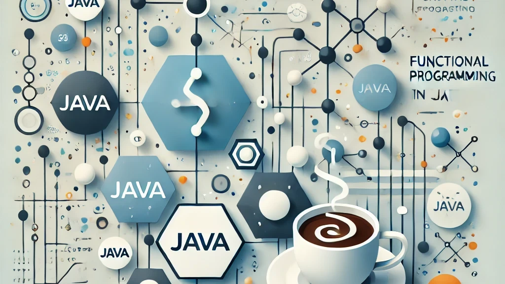

# Functional Programming in Java

**[Functional Programming](01-introduction-to-functional-programming.md)** is a programming paradigm that decomposes a problem into a set of Functions, focusing on immutability, pure functions, and declarative logic. This is becoming a popular approach due to the advantages of **turning complex problems into much simpler and reusable parts**

- **Testing becomes easier**
- **Improves the maintainability** of the system
- Its **predictability** makes this ideally to be run in parallel.

[Java](https://en.wikipedia.org/wiki/Java_(programming_language)) is a high-level Object-Oriented Programming language design to write code once, and run it anywhere on a **Java Virtual Machine** (JVM) regardless on the underlying computer architecture.

## Java is NOT a pure Functional Programming Language

Since its first release in 1996, Java was designed to be a **general-purpose language** with no built-in support for Functional Programming.

This changed in 2014 with the release of **Java 8**, which introduced major features enabling Functional Programming. Since then, more enhancements and new features have been added to better support this paradigm.

However, even after all the support and enhancements introduced, **Java does not enforce Functional Programming core principles**, such as immutability or the use of pure functions, unlike purely functional languages such as Haskell or JVM-based functional languages like Scala, Kotlin, and Clojure.

Hence, if you want to use Functional Programming in Java, you need to heavily rely on **best practices**, **manual code inspection** and **SAC tools** (Static Code Analysis) such as SonarQube.

## Why to use Java for Functional Programming?

So **why to choose Java** for Functional Programing when there has been for a long time several other languages that enforces Functional Programming? Or even other JVM languages that supports Functional Programming?

Main reasons could be

- **More gradual adoption** of the Functional Programming principles. Java offers a **gentler learning curve** allowing developers to adopt these principles incrementally.
- Java has already a **large community and tools**
- Java also **performs really good** in high-performance applications, so that can benefit from parallel programming and multi-threads.

## Java support for Functional Programming

**Java 8** (2014) was the game-changer for Functional Programming in Java, making it possible with the introduction of some major features. Here we can find a list with the main features introduced with this release, each of them will be further explained in follow-up articles:

- Functions become **first-class citizens**: Functions can now be passed as arguments or returned as values.
- **Lambda Expressions**: A concise mechanism for function definition.
- **Functional Interfaces**: Interfaces with a Single Abstract Method (SAM), enabling the use of lambdas.
- **Streams API**: Declarative pipelines for data processing.
- **CompletableFuture**: Functional-style asynchronous programming.

More enhancements have been added in later releases

- Java 9 (2017) Introduction of `Optional`
- Java 9 (2017) Immutable Data Structures: Factory methods like `List.of`, `Set.of`, and `Map.of` allow concise creation of immutable collections.
- Java 11 (2018) `Optional` enhancements like `isEmpty` and `isPresent`.
- Java 12 (2019) introduces `Collectors`.
- Java 14 (2020) introduces switch expressions.

